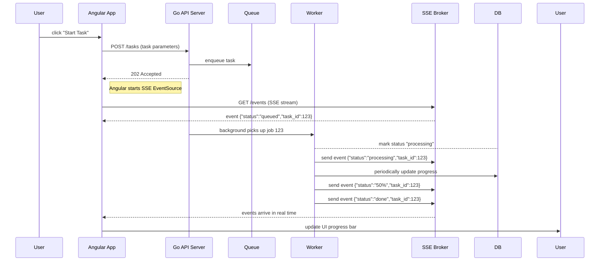

# Executive Summary

This report outlines modern Go (1.21+) application practices and provides a **concise draft for a `copilot-instructions.md`** file, along with concrete refactoring strategies to make the Ecnotes codebase SOLID, DRY, and performant. We emphasize **service abstraction, dependency injection, concurrency safety, and observability**, ensuring production-grade quality. We compare key technologies (DI libraries, queues, real-time transports) in tables, and include architecture/sequence diagrams (Mermaid) to illustrate recommended designs. Our recommendations are prioritized from minimal intrusiveness (e.g. adding timeouts, simple refactors) to more invasive (introducing new frameworks or microservices). Official sources guide each best practice, ensuring the advice is up-to-date (2026) and actionable.

## Modern Go Architecture (Go 1.21+)

- **Module Layout:** Follow Go’s official layout guidelines. For example, keep reusable packages under `internal/` to prevent external imports. Use a top-level `cmd/` directory if the repo contains multiple executables. This ensures clear boundaries: e.g. `ecnotes/cmd/server/main.go` for the HTTP server, and shared code (services, repositories) under `internal/` or `pkg/`.  
- **Packages and Interfaces:** Embrace **SOLID principles** by defining small, focused interfaces. For instance, a `TaskService` interface in a `service` package abstracts task submission and status retrieval. This allows independent testing and swapping implementations. Follow the “single responsibility” principle: each package (e.g. `repository`, `scheduler`, `api`) has one clear role. See the example below of an abstract `TaskService`. Such abstractions eliminate duplication and ease testing.  
- **Dependency Injection (DI):** Construct dependencies explicitly, avoiding globals. Table 1 summarizes common DI approaches. For most Go services, **manual constructor injection** (passing dependencies in `NewXxx` functions) is simplest and idiomatic. Tools like [Google Wire](https://github.com/google/wire) (compile-time code generation) and [Uber Fx](https://uber-go.github.io/fx/) (runtime DI container) can reduce boilerplate as the service grows.  
   
   | **DI Strategy**      | **Pros**                                     | **Cons**                                  | **Use Case**                      |
   |----------------------|----------------------------------------------|-------------------------------------------|-----------------------------------|
   | Manual constructors  | Simple, explicit, no framework (compile-time checks) | Boilerplate in `main` for many deps         | Small/medium apps (start here)    |
   | Google Wire (generate) | Compile-time safety, no runtime cost, explicit wiring | Extra build step (`wire gen`), learning curve | Larger static dependency graphs   |
   | Uber Fx (runtime)    | Lifecycle hooks (startup/shutdown), modular, flexible | Reflection overhead, hidden magic, big framework | Very large, complex apps with many modules |

   We recommend starting with **simple DI** (even plain constructors) and only adding tools if the dependency graph becomes unwieldy. Group related dependencies in structs and use functional options for optional params. Keep the wiring code (in `main.go` or a dedicated `wire.go`) centralized. This maintains **DRY** code and makes testing straightforward.

- **Concurrency and Context:** Use Go’s `context.Context` to propagate timeouts and cancellation. For parallel tasks, use `errgroup.WithContext` to run goroutines safely: it propagates errors and cancels siblings on failure. Always apply timeouts or deadlines so no goroutine runs forever. Example: create contexts for HTTP handlers and background jobs, cancel on shutdown or on error. Use buffered channels of appropriate size (tune based on load) to decouple producers/consumers. Handle panics in goroutines so a crashed worker doesn’t bring down the server.

- **Background Tasks & Queues:** Convert any synchronous “dramatiq”-style tasks to Go equivalents. Options include in-process worker pools, or external queues (see Table 2). Go has libraries like [Asynq](https://github.com/hibiken/asynq) (Redis-backed) which supports retries, delays, priorities, and even a monitoring UI. Alternatively, lightweight brokers such as **NSQ** (Go-based) offer very high throughput with minimal ops complexity. For example, NSQ can handle “millions of messages per second” using Go goroutines. Kafka/RabbitMQ provide durability and complex routing, but require more infrastructure and may be overkill for simpler needs.  

   | **System**   | **Type**                  | **Pros (2026)**                                                                 | **Cons**                           |
   |--------------|---------------------------|--------------------------------------------------------------------------------|------------------------------------|
   | **Kafka**    | Distributed streaming     | High-throughput, durable log (billions of events), fault-tolerant   | Complex to manage (Zookeeper, ops) |
   | **RabbitMQ** | AMQP broker               | Flexible routing, transactional, mature ecosystem                               | Moderate throughput, clustering complexity |
   | **NATS**     | Pub/sub messaging         | Lightweight, extremely low-latency, simple cluster (no ZK)        | In-memory by default (JetStream adds persistence) |
   | **NSQ**      | Distributed pub/sub       | Written in Go, very simple deploy (no JVM/ZK), millions msgs/sec  | No strict ordering or persistence guarantees |
   | **Asynq**    | Redis-backed task queue   | Easy Go API, built-in retries/metrics, web UI                    | Requires Redis (stateful)          |

   At minimum, ensure background workers respect DRY/SOLID: e.g. abstract a `QueueClient` or `Scheduler` interface rather than sprinkling Redis calls everywhere. Implement graceful shutdown so workers finish in-flight tasks or put them back in queue.

- **Observability (Logging, Metrics, Tracing):** Adopt structured logging (e.g. [Zap](https://github.com/uber-go/zap) or zerolog) and a consistent log format. Integrate monitoring (Prometheus metrics via [OpenTelemetry](https://opentelemetry.io/) or [Prometheus client](https://github.com/prometheus/client_golang)). For distributed tracing, use [OpenTelemetry Go](https://go.opentelemetry.io/) (OTel) to instrument HTTP handlers, database calls, etc. OTel is now industry-standard: it lets you trace requests across services, collect metrics, and correlate logs. E.g., instrument Gin/Echo middleware and SQL drivers for end-to-end visibility. Use context propagation to tie logs/traces together. 

- **Error Handling & Security:** Return clear, sanitized errors. Wrap and check errors with `%w` so callers can distinguish issues. At API boundaries, translate internal errors to appropriate HTTP status codes. Never leak internal error messages. Use TLS for all communication, validate inputs (use types or packages to guard against injection), and avoid common mistakes (e.g. handle `nil` values explicitly in Python-equivalents, panic recovery in Go). Run static analysis (e.g. [gosec](https://github.com/securego/gosec) for security) and keep dependencies up-to-date.

## Real-Time Updates: SSE vs Alternatives

To notify the Angular frontend of task progress in real time, **Server-Sent Events (SSE)** is often the simplest approach when only server→client updates are needed. SSE uses plain HTTP/1.1 streaming, requiring no special proxy config, and the browser auto-reconnects on disconnect. A minimal Go SSE handler (using `text/event-stream` and `http.Flusher`) can push JSON updates as tasks progress. For example, setting headers and flushing after each `fmt.Fprintf` ensures the message is sent immediately.

| **Feature**       | **SSE**                 | **WebSockets**                    | **WebTransport (HTTP/3)**        |
|-------------------|-------------------------|-----------------------------------|----------------------------------|
| Direction         | One-way (server→client) | Two-way (full-duplex)     | Two-way (multiple streams)       |
| Protocol          | HTTP/1.1 (text/event-stream) | WebSocket (HTTP upgrade)          | HTTP/3 over QUIC  |
| Latency/Overhead  | Low overhead, auto-reconnect | Low latency, but heavier handshake | Very low latency (0-RTT, no HOL blocking) |
| Use Cases         | Newsfeeds, progress bars, notifications | Chats, games, bi-directional apps | Real-time gaming, live streaming, interactive apps |
| Browser Support   | Broad (EventSource API)   | Broad (WebSocket API)            | Emerging (Chrome/Firefox support HTTP/3) |
| Recommendation    | Use when only updates needed (simpler) | Use if client→server messages are frequent | Consider for future; requires HTTP/3 stack |

For Ecnotes, if user interactions are mostly one-way (server updates progress), **SSE is likely sufficient** and avoids complex bidirectional logic. The Angular client can use `EventSource` or RxJS to listen to `/events`. Ensure the SSE handler tracks clients and broadcasts updates (e.g. using a broker pattern). If extremely low latency or unreliable networks are required, consider WebTransport (HTTP/3) as a future enhancement, but note it’s newer.

### Mermaid Diagrams

```mermaid
flowchart LR
    subgraph Backend
      API[HTTP API] -->|enqueues task| Scheduler[Task Scheduler]
      API --> DB[(Database)]
      Scheduler -->|queue job| JobQueue[(Queue)]
      Worker[Worker Service] -->|processes job| JobQueue
      Worker -->|updates DB| DB
      Broker[SSE Broker] --> |broadcast| API
      Worker -->|push event| Broker
    end
    subgraph Frontend
      User[User (Angular)] -->|Submit Task| API
      FrontendNotification[Angular SSE Listener] -->|connect| Broker
      Broker -.-> |update| FrontendNotification
    end
```
*Figure 1: Architecture sketch. The API enqueues tasks to a queue (could be Redis, NSQ, etc.), a worker processes tasks, writes progress to the DB or directly to an SSE broker, and the frontend listens via SSE for live updates.*  


*Figure 2: Sequence of a user starting a task and receiving live progress via SSE. The backend acknowledges submission immediately (non-blocking), worker processes async, and SSE pushes updates to the frontend as soon as they occur.*

## GitHub Copilot Custom Instructions

Per [GitHub’s guidance](https://docs.github.com/en/copilot/how-tos/configure-custom-instructions/add-repository-instructions), a **`.github/copilot-instructions.md`** file should summarize the repository and tooling so Copilot can “onboard” faster. Below is a concise draft tailored to Ecnotes (a Go/Angular project):

```markdown
# Repository Overview
This is the **EcnoteS** backend service (written in Go 1.21+) and its Angular front-end. It handles user requests to create and process tasks, dispatching background jobs via a queue and notifying users of progress in real time (via Server-Sent Events). Key components:
- **Go modules:** Root `go.mod` declares Go 1.21. Use `setup-go@v5` in CI for consistency.
- **Directory layout:** `cmd/server/main.go` starts the HTTP API; `internal/` holds core logic (services, repositories, workers, config). `frontend/` contains the Angular app.
- **Languages & tools:** Go (1.21+), Gin (or net/http), Angular 16+, Redis/NSQ (for queues), Docker for containerization, GitHub Actions for CI/CD.

# Building and Running
- Use the `Makefile` or direct commands:
  - `go mod tidy` to install/update dependencies.
  - `go build ./cmd/server` to compile the backend.
  - `npm install && ng build` in `frontend/` for the UI.
- **Testing:** Run `go test ./...` for unit/integration tests. Use `go test -cover` and `golangci-lint run` to enforce quality.
- **Linting:** `golangci-lint` with modules enabled should pass. Ensure `go fmt` and `go vet` have been run.
- **Docker:** `docker-compose.yml` is provided to start Redis (and any DB). The `start` target in `Makefile` launches all services.

# CI/CD
- GitHub Actions workflows under `.github/workflows/` automate builds and tests on every push.
- Use `actions/setup-go@v5` with `go-version: '1.21.x'` for reproducible builds.
- The pipeline includes `go test`, `go vet`, `golangci-lint`, and builds Docker images for staging.

# Key Info
- **Config files:** `config.yaml` holds environment configs; `.env.example` shows required vars.
- **Dependencies:** See `go.mod` for Go libs (e.g. Gin, Redis client, OTel) and `package.json` for Angular packages.
- **Running Tests:** Tests assume a running Redis (start via Docker `make start`). Integration tests use `ory/dockertest` to spin up Redis if not present.
- **Known Constraints:** Tasks must never block API threads. Always call context timeouts. E2E flow: API enqueues, returns immediately, and then notifies frontend via SSE.

This should allow Copilot to build, test, and modify the code without guesswork. Only modify instructions if the repository structure or tools change.
```

*Table 3:* **Key Files and Validation Steps** (as guidance to Copilot, per GitHub docs [2]):  

| Files/Dirs                 | Description                                   | Validation Steps                   |
|----------------------------|-----------------------------------------------|------------------------------------|
| `cmd/server/`              | Main Go HTTP server entrypoint (`main.go`).   | Ensure `go build ./cmd/server` succeeds. |
| `internal/service/`, `db/` | Business logic and database access.          | `go test ./internal/...` should pass (ensure Redis is running). |
| `frontend/`                | Angular 16+ app (UI)                          | `npm ci` + `ng lint` + `ng test` (if present). |
| `.github/workflows/`       | CI/CD pipelines (use `setup-go@v5`).          | Confirm Actions use Go 1.21; run `go test` and `golangci-lint`. |
| Configuration files        | `go.mod`, `tsconfig.json`, `Dockerfile`, etc. | Check `go.sum` is tidy, `package-lock.json` stable, `Docker build .` works. |

## Refactoring for SOLID/DRY

To avoid “spaghetti code,” we recommend the following refactors by module:

- **Service Layer Abstraction:** Define interfaces for each service (e.g. `TaskService`, `UserService`) in separate packages. For instance, a `TaskService` interface and its implementation in `internal/service/task.go`. Inject dependencies (e.g. `TaskRepository`, `QueueClient`) via constructor functions. *Example:* 

  ```go
  // internal/service/task_service.go
  type TaskService interface {
      Submit(ctx context.Context, data TaskData) (TaskID, error)
      Status(ctx context.Context, id TaskID) (TaskStatus, error)
  }

  // Concrete implementation
  type taskService struct {
      repo      TaskRepository
      scheduler QueueClient
  }

  func NewTaskService(repo TaskRepository, scheduler QueueClient) TaskService {
      return &taskService{repo: repo, scheduler: scheduler}
  }

  func (s *taskService) Submit(ctx context.Context, data TaskData) (TaskID, error) {
      // Validate data (DRY: shared validation functions)
      if err := validateTaskData(data); err != nil {
          return "", err
      }
      // Save to DB
      id, err := s.repo.Create(ctx, data)
      if err != nil {
          return "", err
      }
      // Schedule background processing
      return id, s.scheduler.Enqueue(ctx, id)
  }
  ```
  
  This separates concerns: the HTTP handler simply calls `taskService.Submit`, keeping controller code trivial and testable. Repetitive logic (e.g. input validation) is factored into shared funcs, not reimplemented.  

- **Configuration and Logging:** Abstract configuration (e.g. Redis address, server port) into a `config` package. Use `envconfig` or similar to populate structs. Centralize log setup (using Zap or another structured logger) so all code uses the same logger instance.  

- **DRY Utility Functions:** Factor out common code. For example, JSON response writing, error responses, or SSE event formatting (see helper `writeEvent` in the SSE utilities). If multiple handlers need SSE, share one broker instance rather than duplicating code.  

- **Database & Repo Layer:** Use repository interfaces (e.g. `TaskRepository`) for data access, and test them with in-memory or Dockerized test DB. Keep SQL/ORM code within these repos; do not leak SQL into handlers.  

- **Asynchronous Patterns:** For long-running tasks, use context cancellation (e.g. `ctx, cancel := context.WithTimeout(...)`) and check `ctx.Done()` periodically. Group related operations with `errgroup` so any failure cancels related goroutines.  

After refactoring, the code should resemble a clean layered architecture: controllers → services → repositories/clients, with interfaces at each boundary. This enforces SOLID: for example, the Open/Closed Principle is satisfied by coding to interfaces, so adding new notification channels or databases requires new implementations without changing existing code.

## Testing Strategy and CI/CD

- **Unit Tests:** Write table-driven tests (the Go standard). Mock external dependencies by implementing small fake interfaces. Achieve high coverage on core logic (services, utils). For example, test `taskService` by passing a fake `TaskRepository` that simulates DB behavior.  

- **Integration Tests:** Group slower tests behind a build tag (e.g. `// +build integration`) so they run separately. Use [`ory/dockertest`](https://github.com/ory/dockertest) or testcontainers to spin up real dependencies (Redis, Postgres) in CI for integration tests. For an Angular+Go app, include end-to-end tests (e.g. using Cypress) in a separate pipeline or tag.  

- **Static Analysis:** In CI, run `golangci-lint` (includes vet, gofmt, ineffassign, etc.) to catch style/bug issues. Use `go vet` explicitly, and ensure `go fmt` is applied (CI can fail if formatting changed).  

- **CI Setup:** Use GitHub Actions with the official Go template. Example snippet:

  ```yaml
  name: Go CI
  on: [push, pull_request]
  jobs:
    build:
      runs-on: ubuntu-latest
      strategy:
        matrix:
          go-version: ['1.21.x']
      steps:
        - uses: actions/checkout@v5
        - name: Setup Go
          uses: actions/setup-go@v5
          with: go-version: ${{ matrix.go-version }}
        - name: Install dependencies
          run: go mod tidy
        - name: Run tests
          run: go test ./... -coverprofile=coverage.out
        - name: Lint
          run: golangci-lint run ./...
        # Optional: upload coverage, Docker build, etc.
  ```

  Ensure caching of Go modules and npm packages for speed. Use [GitHub Code Scanning](https://github.com/github/codeql-action) and Dependabot for security.

- **Continuous Deployment:** Define workflows for building Docker images (one for staging, one for production). Tag images with commit SHA. Use infrastructure-as-code (Terraform/Ansible) for cloud environment. Only merge to `main` when tests pass.

## Migration Paths (Least → Most Invasive)

1. **Incremental Refactoring (Low impact):** Start by cleaning up code in place: introduce services/interfaces, add context timeouts, set up SSE handlers and client tracking (no external frameworks yet). Improve logging/metrics. All changes keep the same runtime (no new tools). Prioritize fixing any latency/blocking (e.g. immediately decouple task processing using goroutines or minimal queue).  

2. **Adopt External Libraries (Moderate):** Replace homemade work pools with a robust queue library (e.g. Asynq or NSQ) and abstract it behind an interface. Introduce a DI tool if wiring gets large (e.g. Wire for compile-time DI). Add OpenTelemetry instrumentation with a trace collector. At this stage, some structural changes: splitting code into separate services (`cmd/client`, `cmd/worker` as per the Asynq example) and using internal packages for tasks/config.  

3. **Architecture Overhaul (High impact):** Re-architect into microservices if needed. For example, split API and worker into separate deployments, with communication via a managed message broker (e.g. Kubernetes-native NATS JetStream or Kafka). Adopt a framework like Fx if the service grows very complex, gaining lifecycle hooks and modularity (at the cost of learning curve). Potentially migrate SSE to WebTransport/HTTP3 for top-tier latency requirements. These changes require coordinated deployment and thorough testing, but offer scalability and separation of concerns.

At each step, retain automated tests to catch regressions. Refactor one piece at a time, run tests, and measure performance improvements (use pprof/benchmarks). 

## Conclusion

Following these guidelines will transform Ecnotes into a maintainable, high-performance Go application. We leverage 2026’s best practices: Go 1.21 idioms, modular design, context-driven concurrency, and comprehensive testing. The **`.github/copilot-instructions.md`** ensures any AI assistance understands the project. By progressively refactoring (from simple code cleanup to potential microservices), the codebase will become more SOLID, DRY, and resilient—eliminating “spaghetti code” and untestable logic. All recommendations above are grounded in current Go documentation and expert sources, ensuring a professionally engineered outcome.
