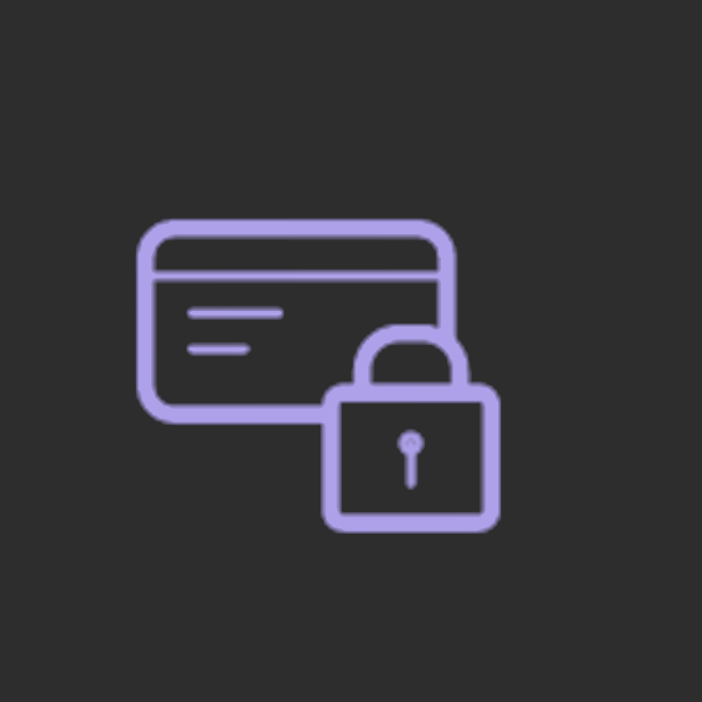
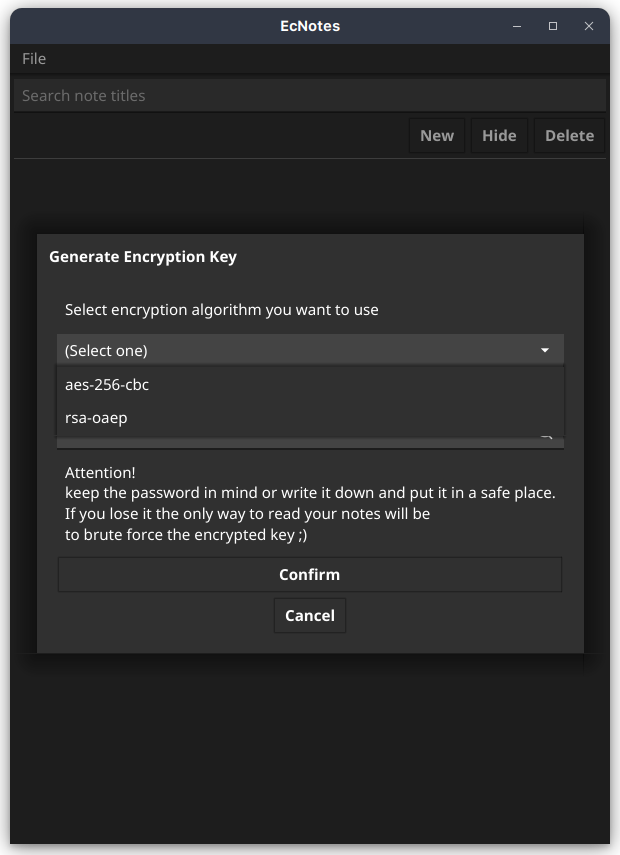
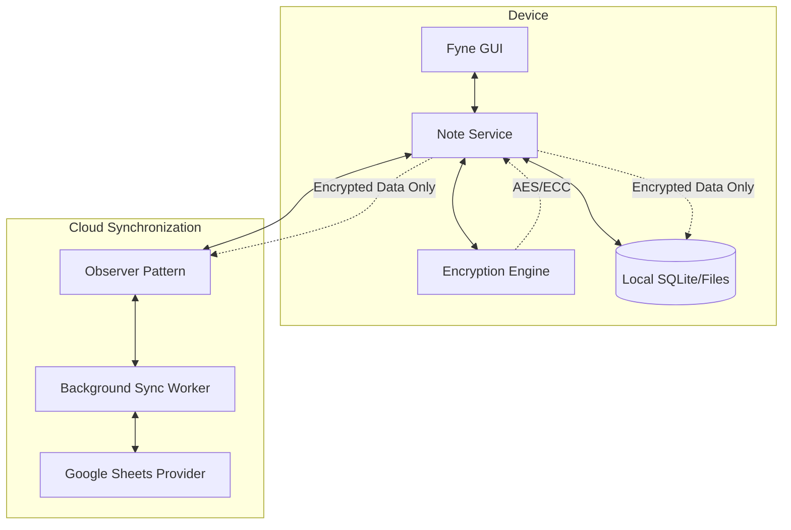
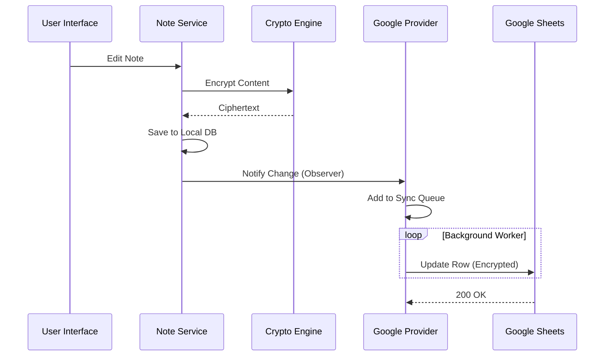

#  EcNotes

[](./LICENSE)
[](https://golang.org)
[](#installation)

**EcNotes** is a high-security, privacy-focused desktop and mobile application designed to store and manage sensitive information such as passwords, crypto keys, and private notes. Built with **Go** and the **Fyne** GUI toolkit, it emphasizes local-first ownership of data and end-to-end encryption.



---

## 🚀 Key Features

- **🔐 End-to-End Encryption**: Choose between different encryption algorithms (AES, ECC). Data is only decrypted in memory during active access.
- **📱 Multi-platform**: Native GUI application running on Linux, Windows, macOS, and Android.
- **☁️ Optional Cloud Sync**: Securely synchronize your encrypted database with Google Sheets. Only encrypted content ever leaves your device.
- **📂 Data Ownership**: You generate and manage your own encryption keys locally.
- **🤝 Shared Keys**: (In Development) Support for ECDH key exchange to share encrypted notes securely with others.

---

## 🏗 Architecture

EcNotes follows a modular, interface-driven architecture to ensure maintainability and security. The core principle is that **Cleartext never leaves the Service Layer**.

### System Overview


### Sync Sequence


---

## 📦 Installation

To build and run EcNotes, you need **Go 1.21+** and the **Fyne** toolkit.

### Dependencies
- [Go](https://golang.org/doc/install)
- [Fyne CLI](https://developer.fyne.io/started/packaging)

### Local Development
```bash
git clone https://github.com/iltoga/ecnotes-go.git
cd ecnotes-go
go run main.go
```

### Packaging for Release
Use the `fyne` utility to package the application for your specific OS:
```bash
# For your current platform
fyne package -icon Icon.png

# For Windows
fyne package -os windows -icon Icon.png
```

---

## 🛠 Local Development & Configuration

EcNotes is designed to be "plug-and-play," but follows a specific hierarchy for configuration and data storage.

### 1. Automatic Initialization
When you run the application for the first time (`go run main.go`), it will automatically:
- Create a configuration directory.
- Generate a default `config.toml`.
- Initialize a local encrypted database.

### 2. Choosing Your Resource Path
The application looks for a `resources` directory in two places:
- **Local Mode**: Create a folder named `resources` in the project root. The app will store all config, logs, and databases there.
- **System Mode (Default)**: If no local `resources` folder exists, the app defaults to `~/.config/ecnotes` (Linux/macOS).

### 3. Required Files (Self-Generated)
The following files are ignored by version control but are essential for the app. The app creates them automatically, but you should be aware of them:
- `config.toml`: Main application settings.
- `key_store.json`: Stores your encrypted master keys. **Never delete this unless you want to lose access to your notes!**
- `db/kv_store`: The encrypted database file.

### 4. Manual Configuration (Optional)
If you need to change the default behavior (e.g., log levels or database paths), edit your `config.toml`:
```toml
log_level = "debug"
kvdb_path = "resources/db/my_notes"
```

---

## ⚙️ External Providers

### Google Sheets Sync
EcNotes can use a Google Sheet as a secure, distributed database. 

#### Setup Steps:
1. **Google Console**: Create a project and Service Account at the [Google Developer Console](https://console.developers.google.com).
2. **Credentials**: Download the Service Account JSON and save it to `#HOME/.config/ecnotes/providers/google/cred_serviceaccount.json`.
3. **Format Sheet**: Create a new Google Sheet and add these headers to the first row:
   `ID | Title | Content | Hidden | Encrypted | EncKeyName | CreatedAt | UpdatedAt`
4. **Configure**: Add your Sheet ID to `config.toml` in `$HOME/.config/ecnotes/resources/`:
   ```toml
   google_sheet_id = "your_sheet_id_here"
   ```

---

## 🛠 Development Standards

This project adheres to strict Go development guidelines to ensure a robust and SECURE codebase:

- **SOLID & DRY**: All logic is abstracted into services and repositories.
- **Context-Aware**: All provider and IO calls respect `context.Context` for cancellation and timeouts.
- **Dependency Injection**: Dependencies are injected via constructors to facilitate testing.
- **Structured Logging**: Leveraging `logrus` for traceable application states.

For more details, see [GOLANG-GUIDELINES.md](./GOLANG-GUIDELINES.md).

---

## 🤝 How to Contribute

We welcome contributions from the community! Whether it's fixing a bug, adding a new provider, or improving documentation.

1. **Branching**: We use `main` for stable releases and `dev` for active development.
2. **Workflow**:
   - Fork the repository.
   - Create a feature branch from `dev`.
   - Ensure your code follows `go fmt`.
   - Run tests: `go test ./...`.
   - Submit a Pull Request to the `dev` branch.
3. **Guidelines**: Please provide a clear description of your changes and link to any relevant issues.

---

## 📄 License & Credits

EcNotes is released under the **MIT License**. See [LICENSE](./LICENSE) for details.

Developed with ❤️ by **iltoga** and contributors.
